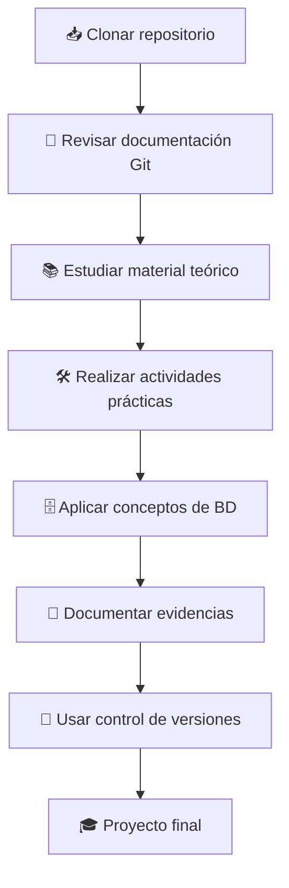
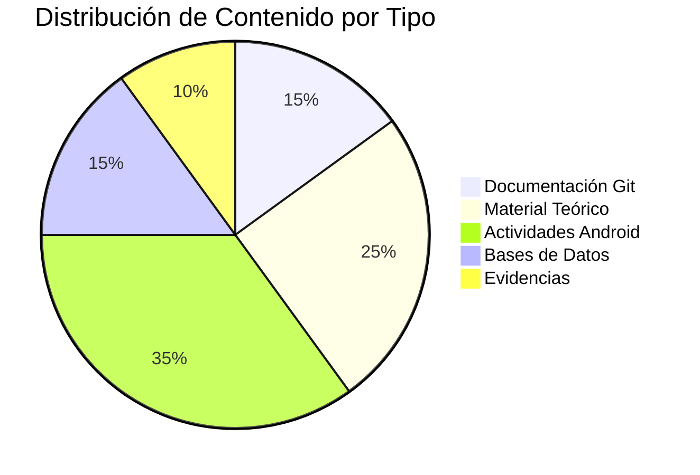

# GitDemo - Proyecto Tecmilenio 🚀

Este repositorio contiene documentación y recursos organizados por temas para el aprendizaje de Git, control de versiones y desarrollo de aplicaciones Android con enfoque en bases de datos y funcionalidades avanzadas.

## 📁 Estructura del Proyecto

```
gitdemo/
├── README.md                           # Índice principal del proyecto
├── .gitignore                          # Archivos ignorados por Git
├── 📚 GitDocumentation/                # Documentación de Git
│   ├── GIT_BASICO.md                  # Conceptos básicos de Git
│   ├── GIT_CHEAT_SHEET.md             # Hoja de referencia rápida
│   └── git_cherry_pick_ejemplo.md     # Ejemplo de cherry-pick
├── 📋 Evidencia/                       # Propuestas y evidencias del curso
│   ├── PROPUESTA_PROYECTO.md          # Propuesta de proyecto
│   └── FASE1.md                       # Documentación Fase 1
├── 📱 Tema04/                          # Android - Actividades Pokémon
│   ├── A4-POKEMON.md                  # Actividad 4 - Proyecto Pokémon
│   └── POKEDEX_MINI_UI.md             # Interfaz mini Pokédex
├── 📖 Tema05/                          # Material de estudio Tema 5
│   └── TEMA05.md                      # Contenido del tema
├── 📖 Tema06/                          # Material de estudio Tema 6
│   └── TEMA06.md                      # Contenido del tema
├── 📖 Tema07/                          # Material de estudio Tema 7
│   ├── TEMA07.md                      # Contenido del tema
│   └── act06Solucion.md               # Solución Actividad 6
├── 📱 Tema08/                          # Android - Servicios y Componentes
│   ├── TEMA08.md                      # Contenido teórico
│   ├── ACTIVIDAD7_INSTRUCCIONES.md    # Instrucciones Actividad 7
│   └── actividad7.md                  # Desarrollo Actividad 7
├── 📱 Tema09/                          # Android - Broadcast Receivers
│   ├── ACT08_INSTRUCCIONES.md         # Instrucciones Actividad 8
│   └── GENERAR_APK_INSTRUCCIONES.md   # Guía para generar APK
├── 📱 Tema10/                          # Android - Servicios Avanzados
│   ├── EJERCICIO.md                   # Ejercicios prácticos
│   └── SERVICIOS.md                   # Documentación de servicios
├── 🗄️ Tema11/                          # Android - Bases de Datos SQLite
│   ├── TEMA11.md                      # Teoría de bases de datos (✨ Actualizado)
│   └── PASOS_PRACTICA11.md            # Práctica con diagrama ER (✨ Nuevo)
├── 📱 Tema12/                          # Próximamente...
└── 🎨 assets/                          # Recursos multimedia
```

## 📋 Índice por Categorías

### 📚 Documentación Git

| Archivo                                                                   | Descripción                     |
| ------------------------------------------------------------------------- | ------------------------------- |
| [GIT_BASICO.md](GitDocumentation/GIT_BASICO.md)                           | Conceptos fundamentales de Git  |
| [GIT_CHEAT_SHEET.md](GitDocumentation/GIT_CHEAT_SHEET.md)                 | Comandos Git más utilizados     |
| [git_cherry_pick_ejemplo.md](GitDocumentation/git_cherry_pick_ejemplo.md) | Ejemplo práctico de cherry-pick |

### 📱 Desarrollo Android

| Tema           | Archivos                                                                                                                                    | Descripción                               |
| -------------- | ------------------------------------------------------------------------------------------------------------------------------------------- | ----------------------------------------- |
| **Tema 04**    | [A4-POKEMON.md](Tema04/A4-POKEMON.md)<br>[POKEDEX_MINI_UI.md](Tema04/POKEDEX_MINI_UI.md)                                                    | Proyecto Pokémon y interfaz UI            |
| **Tema 08**    | [TEMA08.md](Tema08/TEMA08.md)<br>[ACTIVIDAD7_INSTRUCCIONES.md](Tema08/ACTIVIDAD7_INSTRUCCIONES.md)<br>[actividad7.md](Tema08/actividad7.md) | Servicios Android y Actividad 7           |
| **Tema 09**    | [ACT08_INSTRUCCIONES.md](Tema09/ACT08_INSTRUCCIONES.md)<br>[GENERAR_APK_INSTRUCCIONES.md](Tema09/GENERAR_APK_INSTRUCCIONES.md)              | Broadcast Receivers y generación APK      |
| **Tema 10**    | [EJERCICIO.md](Tema10/EJERCICIO.md)<br>[SERVICIOS.md](Tema10/SERVICIOS.md)                                                                  | Servicios avanzados y ejercicios          |
| **🗄️ Tema 11** | [TEMA11.md](Tema11/TEMA11.md) ✨<br>[PASOS_PRACTICA11.md](Tema11/PASOS_PRACTICA11.md) ✨                                                    | **Bases de datos SQLite con diagrama ER** |

### 📖 Material Teórico

| Tema        | Archivo                                                                      | Descripción                      |
| ----------- | ---------------------------------------------------------------------------- | -------------------------------- |
| **Tema 05** | [TEMA05.md](Tema05/TEMA05.md)                                                | Material de estudio              |
| **Tema 06** | [TEMA06.md](Tema06/TEMA06.md)                                                | Material de estudio              |
| **Tema 07** | [TEMA07.md](Tema07/TEMA07.md)<br>[act06Solucion.md](Tema07/act06Solucion.md) | Material de estudio y soluciones |

### 📋 Evidencias y Propuestas

| Archivo                                                  | Descripción                 |
| -------------------------------------------------------- | --------------------------- |
| [PROPUESTA_PROYECTO.md](Evidencia/PROPUESTA_PROYECTO.md) | Propuesta de proyecto final |
| [FASE1.md](Evidencia/FASE1.md)                           | Documentación Fase 1        |

## ✨ Actualizaciones Recientes

### 🗄️ Tema 11 - Bases de Datos SQLite (Nuevas mejoras)

**🎯 Contenido actualizado:**

-  **TEMA11.md**: Reescrito con lenguaje humanizado y analogías fáciles de entender
-  **PASOS_PRACTICA11.md**: Nueva guía práctica con diagrama entidad-relación interactivo

**📊 Características destacadas:**

-  Diagrama ER visual con Mermaid para el sistema de gestión de empleados
-  Explicaciones con analogías cotidianas (bases de datos = almacén organizado)
-  Guía paso a paso para implementar SQLite en Android
-  Estructura clara: Empleado → Departamento → Proyecto

**💡 ¿Por qué es especial?**

-  Transforma conceptos técnicos complejos en explicaciones simples
-  Incluye visualización de relaciones entre entidades
-  Enfoque práctico con ejemplos reales de Android

## 🚀 Cómo usar este repositorio

### 👨‍🎓 Para estudiantes:

1. **🔧 Comienza con Git:** Lee la documentación en `GitDocumentation/` para dominar el control de versiones
2. **⚡ Consulta rápida:** Usa `GIT_CHEAT_SHEET.md` como referencia de comandos esenciales
3. **📚 Sigue la progresión:** Navega por los temas en orden secuencial (Tema05 → Tema11)
4. **🛠️ Practica activamente:** Completa las actividades siguiendo las instrucciones detalladas
5. **🗄️ Destaca en bases de datos:** El Tema11 incluye diagramas visuales y explicaciones simplificadas

### 👨‍🏫 Para instructores:

-  ✅ Cada tema está organizado en su propia carpeta con estructura clara
-  ✅ Las instrucciones de actividades incluyen criterios de evaluación específicos
-  ✅ Los archivos de evidencia están centralizados en `Evidencia/`
-  ✅ Material actualizado con analogías y diagramas para facilitar el aprendizaje

### 🎯 Flujo de trabajo recomendado:



## 🔄 Flujo de desarrollo

### 🚦 Configuración inicial:

1. **Clone el repositorio:** `git clone [URL]`
2. **Explore la estructura:** Revise el árbol de carpetas
3. **Configure su entorno:** Instale Android Studio y dependencias

### 📖 Estudio progresivo:

1. **Fundamentos:** Comience con conceptos básicos (Temas 05-07)
2. **Desarrollo Android:** Implemente funcionalidades (Temas 08-10)
3. **Bases de datos:** Domine SQLite con diagramas ER (Tema 11)
4. **Integración:** Combine todos los conceptos aprendidos

### 🧪 Práctica guiada:

-  Siga las instrucciones paso a paso de cada actividad
-  Use los diagramas ER para entender la estructura de datos
-  Aplique las analogías del Tema 11 para conceptos complejos
-  Documente su progreso en `Evidencia/`

## 🤝 Contribuciones y Colaboración

### 🌟 Para contribuir al proyecto:

1. **🍴 Fork del repositorio:** Crea tu propia copia
2. **🌿 Rama de desarrollo:** Trabaja en una rama separada (`git checkout -b feature/nueva-funcionalidad`)
3. **✨ Implementa mejoras:** Añade contenido siguiendo las convenciones establecidas
4. **📋 Pull Request:** Envía tus cambios con descripción detallada

### 📝 Convenciones del proyecto:

-  **📂 Estructura:** Mantén la organización por temas
-  **🎨 Formato:** Usa Markdown con emojis descriptivos
-  **📊 Diagramas:** Incluye visualizaciones cuando sea apropiado
-  **🔍 Claridad:** Prioriza explicaciones simples y analogías

### 🛠️ Herramientas utilizadas:

-  **Mermaid** para diagramas ER y flowcharts
-  **Markdown** para documentación estructurada
-  **Git** para control de versiones
-  **Android Studio** para desarrollo móvil

---

## 📊 Estadísticas del Proyecto



---

### 🎯 Objetivos de Aprendizaje Alcanzados:

-  ✅ **Control de versiones** con Git
-  ✅ **Desarrollo Android** con Java
-  ✅ **Gestión de bases de datos** con SQLite
-  ✅ **Diseño de interfaces** móviles
-  ✅ **Documentación técnica** profesional
-  ✅ **Diagramas ER** para modelado de datos

---

_🎓 Proyecto académico - Tecmilenio 2025_  
_📱 Curso: Desarrollo de Aplicaciones Móviles y Control de Versiones_  
_🗄️ Especialización: Bases de Datos SQLite con Diagramas ER_

**⭐ ¡Dale estrella al repo si te ha sido útil!**
