# Tema 5. Elementos de interfaz gráfica

## 5.1 Etiquetas

-  TextView es un widget en Android que muestra texto al usuario.
-  Es uno de los elementos más usados en interfaces para cabeceras, títulos, etiquetas y texto informativo.
-  Hereda directamente de la clase View.
-  Su funcionalidad como contenedor de texto es reutilizada por otros widgets como Button y EditText.

### Jerarquía de clases TextView

```mermaid
classDiagram
    class View {
        <<abstract>>
        +int id
        +int visibility
        +onDraw()
        +setVisibility()
        +findViewById()
    }

    class TextView {
        +String text
        +int textSize
        +int textColor
        +setText()
        +getText()
        +setTextSize()
        +setTextColor()
    }

    class Button {
        +OnClickListener listener
        +setOnClickListener()
        +performClick()
    }

    class EditText {
        +InputType inputType
        +boolean editable
        +setInputType()
        +addTextChangedListener()
    }

    View <|-- TextView : hereda
    TextView <|-- Button : reutiliza funcionalidad de texto
    TextView <|-- EditText : reutiliza funcionalidad de texto

    note for View "Clase base abstracta para todos los\ncomponentes de interfaz en Android"
    note for TextView "Abstracción responsable de\ncontener y mostrar texto"
    note for Button "Reutiliza TextView para mostrar\netiquetas en botones"
    note for EditText "Reutiliza TextView para mostrar\ny editar texto"
```



### Pasos para crear un TextView

#### Paso 1. Sigue los pasos 1 al 4 del archivo [GIT_BASICO.md](GIT_BASICO.md) para crear y configurar tu proyecto Android.

Esta vez tienes que seleccionar "Empty Activity" y también debes eliminar el texto "Hello World"

\*\* No olvides agregar a hasanyfa como colaborador del proyecto.

#### Paso 2. Cambia de rama

Puedes hacer lo siguiente:

```bash
# Crear una nueva rama (ejemplo: "feature/login")
git branch nombre_de_rama

# cambiarte a la nueva rama directamente
git checkout nombre_de_rama
```

o también puedes hacer las dos instrucciones anteriores con:

```bash
# crear la rama y cambiarte a la nueva rama directamente
git checkout -b nombre_de_rama
```

\*\* Recomendable hacerlo con un sólo comando.

#### Paso 3. Crear la interfaz y programar el evento en Android Studio

1. **Eliminar la vista inicial**

   -  Abre el archivo `activity_main.xml`.
   -  Borra el **TextView "Hello World"** que aparece por defecto.

2. **Agregar el contenedor principal**

   -  Inserta un **LinearLayout** con orientación **vertical**.
   -  Este será el contenedor donde irás colocando todos los componentes.

3. **Añadir los componentes**

   -  Agrega **dos EditText (Plain Text)** para que el usuario escriba texto.
   -  Inserta un **Button** que usaremos para ejecutar la acción.
   -  Coloca un **TextView**, que mostrará el resultado.

4. **Configurar los textos y propiedades**

   -  Borra el texto por defecto de los **EditText**.
   -  En el atributo **hint**, escribe un mensaje de ayuda (ejemplo: _“Escribe tu nombre”_).
   -  Cambia el texto del **TextView** a _“Hola”_.
   -  Modifica el texto del **Button** para que diga algo como _“Cambiar”_.

5. **Asignar identificadores (id) a los componentes**

   -  Primer EditText → `txt1`
   -  Segundo EditText → `txt2`
   -  Botón → `boton1`
   -  TextView → `VerTexto`

6. **Programar en Java**

   -  Declara las variables en tu clase:
      ```java
      EditText c1, c2;
      TextView VerTexto;
      Button boton1;
      ```
   -  Asocia las vistas con `findViewById()`.

7. **Crear el método para el botón**

   -  Define un método en Java que se ejecutará al hacer clic en el botón.
   -  Dentro del método, coloca la lógica que quieras aplicar (ejemplo: mostrar el texto de los EditText en el TextView).

8. **Conectar el método con el botón**
   -  En el archivo `activity_main.xml`, en el atributo **onClick** del botón, escribe el nombre del método que creaste.

> ** Recuerda **: EditText es un control empleado para introducir datos por teclado, por ello es conocido como la típica caja de texto. Para capturar datos utiliza el método getText(), y para establecer texto usa el método setText().

## 5.2 Textos

### Paleta y propiedades en Android Studio

-  La **Paleta de diseño** de Android Studio tiene dos paneles:

   -  **Panel de categorías**: lista los tipos de componentes disponibles.
   -  **Panel de componentes**: muestra los elementos de la categoría seleccionada.

-  Para usar un componente basta con **arrastrarlo al área de diseño**.

-  Se puede **buscar un componente** con el botón de búsqueda en la Paleta.

-  Los `EditText` permiten definir el tipo de entrada con la propiedad **inputType**:

   -  `textEmailAddress` → correo electrónico
   -  `number` → números
   -  `phone` → teléfono
   -  `textUri` → direcciones web
   -  `text` → texto genérico

-  Propiedades adicionales:
   -  **drawableLeft / drawableRight**: agregan íconos fijos dentro del cuadro de texto.
   -  **hint**: muestra un texto de ayuda hasta que el usuario escribe.
   -  **textColorHint**: define el color del texto del hint.

Ahora que ya aprendiste a agregar componentes y programar un botón, vas a realizar este ejercicio para familiarizarte con la **Paleta de Android Studio** y las propiedades de los `EditText`.

### Ejercicio

✅ **Objetivo del ejercicio**:

-  Aprender a usar la **Paleta de diseño** para arrastrar componentes.
-  Explorar y configurar propiedades como `hint`, `inputType`, `textColorHint` y `drawableLeft`.
-  Practicar cómo leer y mostrar los valores ingresados por el usuario.

#### Instrucciones

1. Abre el archivo `activity_main.xml`.
2. Desde la **Paleta de diseño**:
   -  Inserta **tres EditText** (Plain Text) dentro del `LinearLayout`.
3. Configura sus propiedades:
   -  **Primer EditText**:
      -  `hint` = "Escribe tu correo"
      -  `inputType` = `textEmailAddress` (mostrará teclado de email).
   -  **Segundo EditText**:
      -  `hint` = "Ingresa tu teléfono"
      -  `inputType` = `phone` (mostrará teclado numérico).
   -  **Tercer EditText**:
      -  `hint` = "Ingresa tu sitio web"
      -  `inputType` = `textUri` (validará URLs).
4. Agrega un **Button** con el texto "Validar Datos".
5. Cambia los colores de los `hint` de los EditText usando:
   -  `android:textColorHint` → selecciona un color distinto para cada caja.
6. Opcional: usa la propiedad `drawableLeft` para colocar un ícono en al menos un EditText (ejemplo: un sobre en el de correo).
7. Da un **id** a cada EditText y al botón (ej. `txtCorreo`, `txtTelefono`, `txtWeb`, `btnValidar`).
8. En el archivo Java/Kotlin, asocia las vistas y muestra con un **Toast** los valores que el usuario escriba en cada campo al presionar el botón.

## 5.3 Botones en Android

-  **Button**: botón básico que ejecuta una acción al presionarlo.
   -  Se identifica con un **id** y un texto visible.
   -  Propiedades: `android:background`, `android:textColor`, `android:textSize`, etc.
   -  Evento principal: `onClick(View v)`.

### Tipos de botones

-  **CheckBox**

   -  Dos estados: `true` (marcado) / `false` (no marcado).
   -  Se usa para seleccionar o deseleccionar opciones.
   -  Método: `isChecked()`.

-  **RadioButton**

   -  Similar al CheckBox, pero funciona dentro de un **RadioGroup**.
   -  Solo uno puede estar seleccionado a la vez.
   -  Evento: `onCheckedChanged(RadioGroup group, int checkedId)`.

-  **ToggleButton**

   -  Funciona como un interruptor con dos estados (encendido/apagado).
   -  Evento: `onClick(View v)`.
   -  Estado actual: `isChecked()`.

-  **Switch**

   -  Similar al ToggleButton pero con diseño de **deslizador**.

-  **ImageButton**
   -  Igual que un Button, pero permite mostrar una **imagen** en lugar de texto.

### Ejercicio práctico de Botones en Android Studio

El objetivo es practicar el uso de distintos tipos de botones (`Button`, `CheckBox`, `RadioButton`, `ToggleButton`, `Switch`, `ImageButton`) y aprender a capturar sus eventos.

#### Instrucciones

1. Abre `activity_main.xml` y agrega un **LinearLayout** vertical.

2. Añade los siguientes componentes:

   -  **Button** con id `btnSimple` y texto "Click aquí".
   -  **CheckBox** con id `chkOpcion` y texto "Aceptar términos".
   -  **RadioGroup** con dos **RadioButton** dentro:
      -  `rbOpcion1` → "Opción 1"
      -  `rbOpcion2` → "Opción 2"
   -  **ToggleButton** con id `toggleBoton` y texto "Encendido / Apagado".
   -  **Switch** con id `switchBoton` y texto "Activar notificaciones".
   -  **ImageButton** con id `imgBoton` y una imagen de tu elección.

3. Asigna **id** a cada componente para poder referenciarlos en Java.

4. En el archivo Java:

   -  Declara las variables correspondientes para cada botón.
   -  Asocia los botones usando `findViewById()`.
   -  Programa los eventos:
      -  **Button** → mostrar un `Toast` con un mensaje.
      -  **CheckBox** → mostrar un `Toast` indicando si está marcado o no (`isChecked()`).
      -  **RadioGroup** → mostrar un `Toast` con la opción seleccionada (`onCheckedChanged`).
      -  **ToggleButton y Switch** → mostrar un `Toast` indicando su estado (`isChecked()`).
      -  **ImageButton** → mostrar un `Toast` al hacer clic.

5. Ejecuta la aplicación y prueba que cada botón funcione correctamente.
