# 📱 Tema 5. Elementos de interfaz gráfica

> 🎯 **Aprende a crear interfaces de usuario atractivas y funcionales en Android**

## 📚 Índice

-  [🏷️ 5.1 Etiquetas](#-51-etiquetas)
-  [📝 5.2 Textos](#-52-textos)
-  [🔘 5.3 Botones](#-53-botones-en-android)

---

## 🏷️ 5.1 Etiquetas

-  📝 **TextView** es un widget en Android que muestra texto al usuario.
-  🎯 Es uno de los elementos más usados en interfaces para cabeceras, títulos, etiquetas y texto informativo.
-  🏗️ Hereda directamente de la clase **View**.
-  ♻️ Su funcionalidad como contenedor de texto es reutilizada por otros widgets como **Button** y **EditText**.

### 🏗️ Jerarquía de clases TextView

```mermaid
classDiagram
    class View {
        <<abstract>>
        +int id
        +int visibility
        +onDraw()
        +setVisibility()
        +findViewById()
    }

    class TextView {
        +String text
        +int textSize
        +int textColor
        +setText()
        +getText()
        +setTextSize()
        +setTextColor()
    }

    class Button {
        +OnClickListener listener
        +setOnClickListener()
        +performClick()
    }

    class EditText {
        +InputType inputType
        +boolean editable
        +setInputType()
        +addTextChangedListener()
    }

    View <|-- TextView : hereda
    TextView <|-- Button : reutiliza funcionalidad de texto
    TextView <|-- EditText : reutiliza funcionalidad de texto

    note for View "Clase base abstracta para todos los\ncomponentes de interfaz en Android"
    note for TextView "Abstracción responsable de\ncontener y mostrar texto"
    note for Button "Reutiliza TextView para mostrar\netiquetas en botones"
    note for EditText "Reutiliza TextView para mostrar\ny editar texto"
```



### 📋 Pasos para crear un TextView

#### 🚀 Paso 1. Configuración inicial del proyecto

Sigue los pasos 1 al 4 del archivo [GIT_BASICO.md](GIT_BASICO.md) para crear y configurar tu proyecto Android.

Esta vez tienes que seleccionar **"Empty Activity"** y también debes eliminar el texto "Hello World"

> ⚠️ **No olvides** agregar a `hasanyfa` como colaborador del proyecto.

#### 🌿 Paso 2. Cambio de rama

Puedes hacer lo siguiente:

```bash
# 🆕 Crear una nueva rama (ejemplo: "feature/login")
git branch nombre_de_rama

# 🔄 Cambiarte a la nueva rama directamente
git checkout nombre_de_rama
```

O también puedes hacer las dos instrucciones anteriores con:

```bash
# ⚡ Crear la rama y cambiarte a la nueva rama directamente
git checkout -b nombre_de_rama
```

> 💡 **Recomendación**: Hazlo con un sólo comando.

#### 💻 Paso 3. Crear la interfaz y programar el evento en Android Studio

1. **🗑️ Eliminar la vista inicial**

   -  Abre el archivo `activity_main.xml`.
   -  Borra el **TextView "Hello World"** que aparece por defecto.

2. **Agregar el contenedor principal**

   -  Inserta un **LinearLayout** con orientación **vertical**.
   -  Este será el contenedor donde irás colocando todos los componentes.

3. **Añadir los componentes**

   -  Agrega **dos EditText (Plain Text)** para que el usuario escriba texto.
   -  Inserta un **Button** que usaremos para ejecutar la acción.
   -  Coloca un **TextView**, que mostrará el resultado.

4. **Configurar los textos y propiedades**

   -  Borra el texto por defecto de los **EditText**.
   -  En el atributo **hint**, escribe un mensaje de ayuda (ejemplo: _“Escribe tu nombre”_).
   -  Cambia el texto del **TextView** a _“Hola”_.
   -  Modifica el texto del **Button** para que diga algo como _“Cambiar”_.

5. **Asignar identificadores (id) a los componentes**

   -  Primer EditText → `txt1`
   -  Segundo EditText → `txt2`
   -  Botón → `boton1`
   -  TextView → `VerTexto`

6. **Programar en Java**

   -  Declara las variables en tu clase:
      ```java
      EditText c1, c2;
      TextView VerTexto;
      Button boton1;
      ```
   -  Asocia las vistas con `findViewById()`.

7. **Crear el método para el botón**

   -  Define un método en Java que se ejecutará al hacer clic en el botón.
   -  Dentro del método, coloca la lógica que quieras aplicar (ejemplo: mostrar el texto de los EditText en el TextView).

8. **Conectar el método con el botón**
   -  En el archivo `activity_main.xml`, en el atributo **onClick** del botón, escribe el nombre del método que creaste.

> 📝 **Recuerda**: EditText es un control empleado para introducir datos por teclado, por ello es conocido como la típica caja de texto. Para capturar datos utiliza el método `getText()`, y para establecer texto usa el método `setText()`.

---

## 📝 5.2 Textos

### 🎨 Paleta y propiedades en Android Studio

-  🎛️ La **Paleta de diseño** de Android Studio tiene dos paneles:

   -  📋 **Panel de categorías**: lista los tipos de componentes disponibles.
   -  🧩 **Panel de componentes**: muestra los elementos de la categoría seleccionada.

-  🖱️ Para usar un componente basta con **arrastrarlo al área de diseño**.

-  🔍 Se puede **buscar un componente** con el botón de búsqueda en la Paleta.

-  ⌨️ Los `EditText` permiten definir el tipo de entrada con la propiedad **inputType**:

   -  📧 `textEmailAddress` → correo electrónico
   -  🔢 `number` → números
   -  📞 `phone` → teléfono
   -  🌐 `textUri` → direcciones web
   -  📝 `text` → texto genérico

-  🎨 Propiedades adicionales:
   -  🖼️ **drawableLeft / drawableRight**: agregan íconos fijos dentro del cuadro de texto.
   -  💡 **hint**: muestra un texto de ayuda hasta que el usuario escribe.
   -  🎨 **textColorHint**: define el color del texto del hint.

Ahora que ya aprendiste a agregar componentes y programar un botón, vas a realizar este ejercicio para familiarizarte con la **Paleta de Android Studio** y las propiedades de los `EditText`.

### 💻 Ejercicio

✅ **Objetivo del ejercicio**:

-  🎯 Aprender a usar la **Paleta de diseño** para arrastrar componentes.
-  ⚙️ Explorar y configurar propiedades como `hint`, `inputType`, `textColorHint` y `drawableLeft`.
-  📚 Practicar cómo leer y mostrar los valores ingresados por el usuario.

#### 📋 Instrucciones

1. 📂 Abre el archivo `activity_main.xml`.
2. 🎨 Desde la **Paleta de diseño**:
   -  ✏️ Inserta **tres EditText** (Plain Text) dentro del `LinearLayout`.
3. ⚙️ Configura sus propiedades:
   -  📧 **Primer EditText**:
      -  `hint` = "Escribe tu correo"
      -  `inputType` = `textEmailAddress` (mostrará teclado de email).
   -  📞 **Segundo EditText**:
      -  `hint` = "Ingresa tu teléfono"
      -  `inputType` = `phone` (mostrará teclado numérico).
   -  🌐 **Tercer EditText**:
      -  `hint` = "Ingresa tu sitio web"
      -  `inputType` = `textUri` (validará URLs).
4. 🔘 Agrega un **Button** con el texto "Validar Datos".
5. 🎨 Cambia los colores de los `hint` de los EditText usando:
   -  🌈 `android:textColorHint` → selecciona un color distinto para cada caja.
6. 🎨 **Opcional**: usa la propiedad `drawableLeft` para colocar un ícono en al menos un EditText (ejemplo: un sobre en el de correo).
7. 🏷️ Da un **id** a cada EditText y al botón (ej. `txtCorreo`, `txtTelefono`, `txtWeb`, `btnValidar`).
8. ☕ En el archivo Java, asocia las vistas y muestra con un **Toast** los valores que el usuario escriba en cada campo al presionar el botón.

---

## 🔘 5.3 Botones en Android

-  🔲 **Button**: botón básico que ejecuta una acción al presionarlo.
   -  🏷️ Se identifica con un **id** y un texto visible.
   -  🎨 Propiedades: `android:background`, `android:textColor`, `android:textSize`, etc.
   -  ⚡ Evento principal: `onClick(View v)`.

### 🎛️ Tipos de botones

-  ☑️ **CheckBox**

   -  🔄 Dos estados: `true` (marcado) / `false` (no marcado).
   -  ✅ Se usa para seleccionar o deseleccionar opciones.
   -  🔍 Método: `isChecked()`.

-  🔘 **RadioButton**

   -  📋 Similar al CheckBox, pero funciona dentro de un **RadioGroup**.
   -  1️⃣ Solo uno puede estar seleccionado a la vez.
   -  ⚡ Evento: `onCheckedChanged(RadioGroup group, int checkedId)`.

-  🔄 **ToggleButton**

   -  ⚡ Funciona como un interruptor con dos estados (encendido/apagado).
   -  🖱️ Evento: `onClick(View v)`.
   -  🔍 Estado actual: `isChecked()`.

-  🎚️ **Switch**

   -  📱 Similar al ToggleButton pero con diseño de **deslizador**.

-  🖼️ **ImageButton**
   -  🖼️ Igual que un Button, pero permite mostrar una **imagen** en lugar de texto.

### 🧪 Ejercicio práctico de Botones en Android Studio

🎯 El objetivo es practicar el uso de distintos tipos de botones (`Button`, `CheckBox`, `RadioButton`, `ToggleButton`, `Switch`, `ImageButton`) y aprender a capturar sus eventos.

#### 📋 Instrucciones

1. 📂 Abre `activity_main.xml` y agrega un **LinearLayout** vertical.

2. 🧩 Añade los siguientes componentes:

   -  🔘 **Button** con id `btnSimple` y texto "Click aquí".
   -  ☑️ **CheckBox** con id `chkOpcion` y texto "Aceptar términos".
   -  🔘 **RadioGroup** con dos **RadioButton** dentro:
      -  `rbOpcion1` → "Opción 1"
      -  `rbOpcion2` → "Opción 2"
   -  🔄 **ToggleButton** con id `toggleBoton` y texto "Encendido / Apagado".
   -  🎚️ **Switch** con id `switchBoton` y texto "Activar notificaciones".
   -  🖼️ **ImageButton** con id `imgBoton` y una imagen de tu elección.

3. 🏷️ Asigna **id** a cada componente para poder referenciarlos en Java.

4. ☕ En el archivo Java:

   -  📋 Declara las variables correspondientes para cada botón.
   -  🔗 Asocia los botones usando `findViewById()`.
   -  ⚡ Programa los eventos:
      -  🔘 **Button** → mostrar un `Toast` con un mensaje.
      -  ☑️ **CheckBox** → mostrar un `Toast` indicando si está marcado o no (`isChecked()`).
      -  🔘 **RadioGroup** → mostrar un `Toast` con la opción seleccionada (`onCheckedChanged`).
      -  🔄 **ToggleButton y Switch** → mostrar un `Toast` indicando su estado (`isChecked()`).
      -  🖼️ **ImageButton** → mostrar un `Toast` al hacer clic.

5. ▶️ Ejecuta la aplicación y prueba que cada botón funcione correctamente.

---

## 🎯 Conclusión

¡Felicitaciones! 🎉 Has aprendido los conceptos fundamentales de los elementos de interfaz gráfica en Android:

-  📝 **TextView**: Para mostrar texto estático
-  ✏️ **EditText**: Para entrada de datos del usuario
-  🔘 **Botones**: Diferentes tipos para interacción (Button, CheckBox, RadioButton, ToggleButton, Switch, ImageButton)

### 💡 Próximos pasos

-  🔄 Practica combinando diferentes elementos
-  🎨 Experimenta con propiedades de estilo
-  📱 Crea interfaces más complejas
-  🧪 Prueba diferentes tipos de entrada (`inputType`)

### 📚 Recursos adicionales

-  📖 [Documentación oficial de Android](https://developer.android.com/guide/topics/ui)
-  🎨 [Material Design Guidelines](https://material.io/design)
-  💻 [Ejemplos de código en GitHub](https://github.com/android)

---

### 💡 ProTip

> 🚀 **¡Nunca dejes de aprender!** El desarrollo de aplicaciones móviles es un campo en constante evolución.
>
> 🔥 **Consejos para seguir creciendo:**
>
> -  📱 Practica creando mini-aplicaciones cada semana (aunque lo seguiremos haciendo con cada tema..😂)
> -  🌟 Experimenta con nuevos componentes de UI
> -  👥 Únete a comunidades de desarrolladores Android
> -  📚 Mantente actualizado con las últimas versiones de Android
> -  🎯 Enfócate en crear experiencias de usuario intuitivas
>
> 💪 **¡Tu próxima app podría cambiar el mundo!** 🌍
