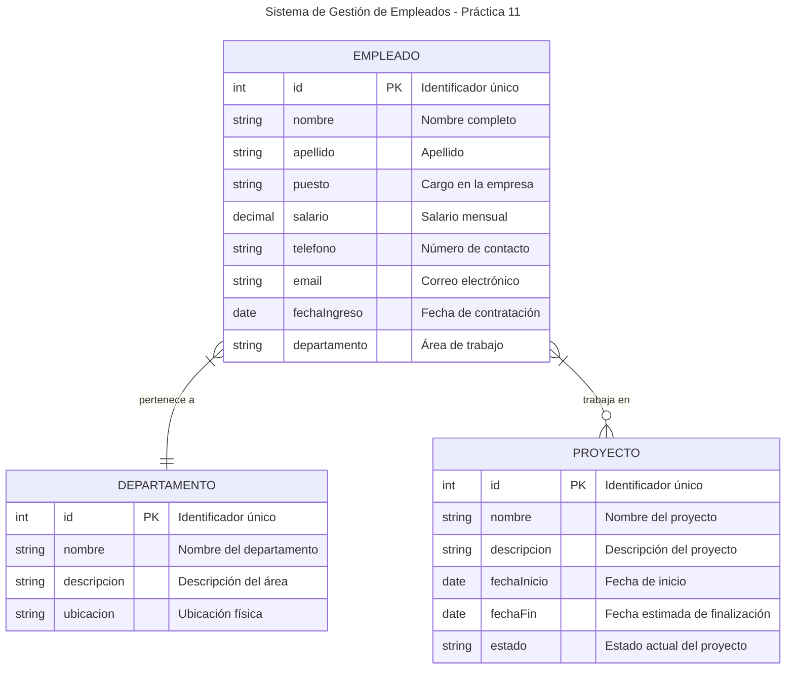

# 🚀 Guía paso a paso — Actividad 9: SQLite con Java

## 🧩 Objetivo

Construir una aplicación Android llamada **actividad9** que utilice **SQLite** para realizar operaciones CRUD (Crear, Leer, Actualizar y Eliminar) sobre una tabla de empleados.  
La práctica tiene como propósito aplicar los conceptos de **SQL** y **SQLite** en el contexto del desarrollo móvil con Android.

---

## 🧠 Teoría previa

### ¿Qué es SQL?

SQL (Structured Query Language) es el lenguaje estándar para manipular datos en bases de datos relacionales. Permite:

-  Crear tablas y esquemas (`CREATE TABLE`).
-  Insertar, modificar y eliminar datos (`INSERT`, `UPDATE`, `DELETE`).
-  Consultar información (`SELECT`).
-  Controlar transacciones.

### ¿Qué es SQLite?

SQLite es una implementación ligera y embebida del lenguaje SQL.  
Características:

-  No necesita servidor (usa archivos locales `.db`).
-  Ideal para dispositivos móviles.
-  Compatible con la mayoría de los comandos SQL.
-  Está **integrado en Android** por defecto.

### 📊 Diagrama Entidad-Relación de nuestra práctica

Para visualizar mejor la estructura de datos que manejaremos en esta práctica, aquí está el diagrama entidad-relación de nuestra base de datos de empleados:



**💡 Explicación del diagrama:**

-  **EMPLEADO**: Entidad principal que almacena la información básica de cada trabajador
-  **DEPARTAMENTO**: Organiza a los empleados por áreas de trabajo
-  **PROYECTO**: Representa los proyectos en los que pueden participar los empleados
-  **Relaciones**: Un empleado pertenece a un departamento y puede trabajar en varios proyectos

En esta práctica nos enfocaremos principalmente en la entidad **EMPLEADO** para aprender los conceptos fundamentales de SQLite.

---

## ⚙️ Paso 1: Crear el proyecto

1. Abre **Android Studio** → **New Project → Empty Views Activity**
2. Asigna estos valores:
   -  **Name:** `actividad9`
   -  **Language:** Java
   -  **Minimum SDK:** API 28
3. Clic en **Finish**.

---

## ⚙️ Paso 2: Configurar Gradle

Abre el archivo `app/build.gradle` y asegúrate de incluir lo siguiente:

```gradle
android {
    namespace 'com.example.actividad9'
    compileSdk 28

    defaultConfig {
        applicationId "com.example.actividad9"
        minSdk 21
        targetSdk 28
        versionCode 1
        versionName "1.0"
    }

    buildFeatures {
        viewBinding true
    }
}

dependencies {
    implementation 'androidx.appcompat:appcompat:1.1.0'
    implementation 'com.google.android.material:material:1.2.1'
    implementation 'androidx.constraintlayout:constraintlayout:1.1.3'
    implementation 'androidx.recyclerview:recyclerview:1.1.0'
    implementation 'androidx.cardview:cardview:1.0.0'
}
```

Sincroniza con **Sync Now** cuando Android Studio lo indique.

---

## 🧱 Paso 3: Crear la estructura de paquetes

Dentro de `java/com.example.actividad9/` crea las carpetas:

```
├── data
├── model
└── ui
```

Cada paquete contendrá una parte de la arquitectura MVC de la app.

---

## 🧩 Paso 4: Crear las clases Java

### 4.1 `model/Employee.java`

Define el modelo de datos.

```java
package com.example.actividad9.model;

public class Employee {
    private long id;
    private String name;
    private String position;
    private double salary;

    // Constructor vacío
    public Employee() {
    }

    // Constructor completo
    public Employee(long id, String name, String position, double salary) {
        this.id = id;
        this.name = name;
        this.position = position;
        this.salary = salary;
    }

    // Constructor sin ID (para insertar nuevos empleados)
    public Employee(String name, String position, double salary) {
        this.name = name;
        this.position = position;
        this.salary = salary;
    }

    // Getters
    public long getId() { return id; }
    public String getName() { return name; }
    public String getPosition() { return position; }
    public double getSalary() { return salary; }

    // Setters
    public void setId(long id) { this.id = id; }
    public void setName(String name) { this.name = name; }
    public void setPosition(String position) { this.position = position; }
    public void setSalary(double salary) { this.salary = salary; }

    @Override
    public String toString() {
        return "Employee{" +
                "id=" + id +
                ", name='" + name + '\'' +
                ", position='" + position + '\'' +
                ", salary=" + salary +
                '}';
    }
}
```

---

### 4.2 `data/DBContract.java`

Define la estructura de la tabla.

```java
package com.example.actividad9.data;

import android.provider.BaseColumns;

public final class DBContract {

    // Constructor privado para evitar instanciación
    private DBContract() {}

    public static class EmployeeEntry implements BaseColumns {
        public static final String TABLE_NAME = "employees";
        public static final String COL_NAME = "name";
        public static final String COL_POSITION = "position";
        public static final String COL_SALARY = "salary";

        // SQL para crear la tabla
        public static final String SQL_CREATE_TABLE =
            "CREATE TABLE " + TABLE_NAME + " (" +
            _ID + " INTEGER PRIMARY KEY AUTOINCREMENT, " +
            COL_NAME + " TEXT NOT NULL, " +
            COL_POSITION + " TEXT, " +
            COL_SALARY + " REAL DEFAULT 0);";

        // SQL para eliminar la tabla
        public static final String SQL_DELETE_TABLE =
            "DROP TABLE IF EXISTS " + TABLE_NAME;
    }
}
```

---

### 4.3 `data/DBHelper.java`

Crea y gestiona la base de datos.

```java
package com.example.actividad9.data;

import android.content.Context;
import android.database.sqlite.SQLiteDatabase;
import android.database.sqlite.SQLiteOpenHelper;
import android.util.Log;

public class DBHelper extends SQLiteOpenHelper {
    private static final String TAG = "DBHelper";
    private static final String DB_NAME = "company.db";
    private static final int DB_VERSION = 1;

    public DBHelper(Context context) {
        super(context, DB_NAME, null, DB_VERSION);
    }

    @Override
    public void onCreate(SQLiteDatabase db) {
        Log.d(TAG, "Creando base de datos...");
        db.execSQL(DBContract.EmployeeEntry.SQL_CREATE_TABLE);
        Log.d(TAG, "Base de datos creada exitosamente");

        // Insertar datos de ejemplo
        insertSampleData(db);
    }

    @Override
    public void onUpgrade(SQLiteDatabase db, int oldVersion, int newVersion) {
        Log.d(TAG, "Actualizando base de datos de versión " + oldVersion + " a " + newVersion);
        db.execSQL(DBContract.EmployeeEntry.SQL_DELETE_TABLE);
        onCreate(db);
    }

    private void insertSampleData(SQLiteDatabase db) {
        // Insertar empleados de ejemplo
        db.execSQL("INSERT INTO " + DBContract.EmployeeEntry.TABLE_NAME +
                   " (name, position, salary) VALUES ('Juan Pérez', 'Desarrollador', 45000.0)");
        db.execSQL("INSERT INTO " + DBContract.EmployeeEntry.TABLE_NAME +
                   " (name, position, salary) VALUES ('María García', 'Diseñadora', 42000.0)");
        db.execSQL("INSERT INTO " + DBContract.EmployeeEntry.TABLE_NAME +
                   " (name, position, salary) VALUES ('Carlos López', 'Gerente', 55000.0)");
        Log.d(TAG, "Datos de ejemplo insertados");
    }
}
```

---

### 4.4 `data/EmployeeDao.java`

Contiene los métodos CRUD.

```java
package com.example.actividad9.data;

import android.content.ContentValues;
import android.content.Context;
import android.database.Cursor;
import android.database.SQLException;
import android.database.sqlite.SQLiteDatabase;
import android.util.Log;

import com.example.actividad9.model.Employee;

import java.util.ArrayList;
import java.util.List;

public class EmployeeDao {
    private static final String TAG = "EmployeeDao";
    private final DBHelper helper;

    public EmployeeDao(Context context) {
        helper = new DBHelper(context);
    }

    // Insertar nuevo empleado
    public long insert(Employee employee) {
        SQLiteDatabase db = helper.getWritableDatabase();
        long newRowId = -1;

        try {
            ContentValues values = new ContentValues();
            values.put(DBContract.EmployeeEntry.COL_NAME, employee.getName());
            values.put(DBContract.EmployeeEntry.COL_POSITION, employee.getPosition());
            values.put(DBContract.EmployeeEntry.COL_SALARY, employee.getSalary());

            newRowId = db.insert(DBContract.EmployeeEntry.TABLE_NAME, null, values);
            Log.d(TAG, "Empleado insertado con ID: " + newRowId);
        } catch (SQLException e) {
            Log.e(TAG, "Error al insertar empleado: " + e.getMessage());
        } finally {
            db.close();
        }

        return newRowId;
    }

    // Actualizar empleado existente
    public int update(Employee employee) {
        SQLiteDatabase db = helper.getWritableDatabase();
        int rowsAffected = 0;

        try {
            ContentValues values = new ContentValues();
            values.put(DBContract.EmployeeEntry.COL_NAME, employee.getName());
            values.put(DBContract.EmployeeEntry.COL_POSITION, employee.getPosition());
            values.put(DBContract.EmployeeEntry.COL_SALARY, employee.getSalary());

            String whereClause = DBContract.EmployeeEntry._ID + " = ?";
            String[] whereArgs = { String.valueOf(employee.getId()) };

            rowsAffected = db.update(DBContract.EmployeeEntry.TABLE_NAME, values, whereClause, whereArgs);
            Log.d(TAG, "Empleado actualizado. Filas afectadas: " + rowsAffected);
        } catch (SQLException e) {
            Log.e(TAG, "Error al actualizar empleado: " + e.getMessage());
        } finally {
            db.close();
        }

        return rowsAffected;
    }

    // Eliminar empleado por ID
    public int delete(long id) {
        SQLiteDatabase db = helper.getWritableDatabase();
        int rowsDeleted = 0;

        try {
            String whereClause = DBContract.EmployeeEntry._ID + " = ?";
            String[] whereArgs = { String.valueOf(id) };

            rowsDeleted = db.delete(DBContract.EmployeeEntry.TABLE_NAME, whereClause, whereArgs);
            Log.d(TAG, "Empleado eliminado. Filas eliminadas: " + rowsDeleted);
        } catch (SQLException e) {
            Log.e(TAG, "Error al eliminar empleado: " + e.getMessage());
        } finally {
            db.close();
        }

        return rowsDeleted;
    }

    // Obtener todos los empleados
    public List<Employee> getAll() {
        List<Employee> employees = new ArrayList<>();
        SQLiteDatabase db = helper.getReadableDatabase();

        String[] projection = {
            DBContract.EmployeeEntry._ID,
            DBContract.EmployeeEntry.COL_NAME,
            DBContract.EmployeeEntry.COL_POSITION,
            DBContract.EmployeeEntry.COL_SALARY
        };

        try (Cursor cursor = db.query(
                DBContract.EmployeeEntry.TABLE_NAME,
                projection,
                null,
                null,
                null,
                null,
                DBContract.EmployeeEntry.COL_NAME + " ASC"
        )) {
            while (cursor.moveToNext()) {
                Employee employee = new Employee();
                employee.setId(cursor.getLong(cursor.getColumnIndexOrThrow(DBContract.EmployeeEntry._ID)));
                employee.setName(cursor.getString(cursor.getColumnIndexOrThrow(DBContract.EmployeeEntry.COL_NAME)));
                employee.setPosition(cursor.getString(cursor.getColumnIndexOrThrow(DBContract.EmployeeEntry.COL_POSITION)));
                employee.setSalary(cursor.getDouble(cursor.getColumnIndexOrThrow(DBContract.EmployeeEntry.COL_SALARY)));

                employees.add(employee);
            }
            Log.d(TAG, "Se obtuvieron " + employees.size() + " empleados");
        } catch (SQLException e) {
            Log.e(TAG, "Error al obtener empleados: " + e.getMessage());
        } finally {
            db.close();
        }

        return employees;
    }

    // Obtener empleado por ID
    public Employee getById(long id) {
        SQLiteDatabase db = helper.getReadableDatabase();
        Employee employee = null;

        String[] projection = {
            DBContract.EmployeeEntry._ID,
            DBContract.EmployeeEntry.COL_NAME,
            DBContract.EmployeeEntry.COL_POSITION,
            DBContract.EmployeeEntry.COL_SALARY
        };

        String selection = DBContract.EmployeeEntry._ID + " = ?";
        String[] selectionArgs = { String.valueOf(id) };

        try (Cursor cursor = db.query(
                DBContract.EmployeeEntry.TABLE_NAME,
                projection,
                selection,
                selectionArgs,
                null,
                null,
                null
        )) {
            if (cursor.moveToFirst()) {
                employee = new Employee();
                employee.setId(cursor.getLong(cursor.getColumnIndexOrThrow(DBContract.EmployeeEntry._ID)));
                employee.setName(cursor.getString(cursor.getColumnIndexOrThrow(DBContract.EmployeeEntry.COL_NAME)));
                employee.setPosition(cursor.getString(cursor.getColumnIndexOrThrow(DBContract.EmployeeEntry.COL_POSITION)));
                employee.setSalary(cursor.getDouble(cursor.getColumnIndexOrThrow(DBContract.EmployeeEntry.COL_SALARY)));
            }
        } catch (SQLException e) {
            Log.e(TAG, "Error al obtener empleado por ID: " + e.getMessage());
        } finally {
            db.close();
        }

        return employee;
    }
}
```

---

## 🎨 Paso 5: Crear los layouts XML

### 5.1 `activity_main.xml`

Contiene el RecyclerView y el FAB.

```xml
<?xml version="1.0" encoding="utf-8"?>
<androidx.coordinatorlayout.widget.CoordinatorLayout
    xmlns:android="http://schemas.android.com/apk/res/android"
    xmlns:app="http://schemas.android.com/apk/res-auto"
    android:layout_width="match_parent"
    android:layout_height="match_parent"
    android:background="#F5F5F5">

    <androidx.recyclerview.widget.RecyclerView
        android:id="@+id/rvEmployees"
        android:layout_width="match_parent"
        android:layout_height="match_parent"
        android:padding="8dp"
        android:clipToPadding="false"
        android:scrollbars="vertical" />

    <com.google.android.material.floatingactionbutton.FloatingActionButton
        android:id="@+id/fabAdd"
        android:layout_width="wrap_content"
        android:layout_height="wrap_content"
        android:layout_gravity="bottom|end"
        android:layout_margin="16dp"
        android:contentDescription="Agregar empleado"
        app:srcCompat="@android:drawable/ic_input_add"
        app:tint="@android:color/white" />

</androidx.coordinatorlayout.widget.CoordinatorLayout>
```

### 5.2 `item_employee.xml`

Diseño para cada tarjeta de empleado.

```xml
<?xml version="1.0" encoding="utf-8"?>
<androidx.cardview.widget.CardView
    xmlns:android="http://schemas.android.com/apk/res/android"
    xmlns:app="http://schemas.android.com/apk/res-auto"
    android:layout_width="match_parent"
    android:layout_height="wrap_content"
    android:layout_margin="4dp"
    app:cardCornerRadius="8dp"
    app:cardElevation="4dp"
    android:foreground="?android:attr/selectableItemBackground"
    android:clickable="true"
    android:focusable="true">

    <LinearLayout
        android:layout_width="match_parent"
        android:layout_height="wrap_content"
        android:orientation="vertical"
        android:padding="16dp">

        <TextView
            android:id="@+id/tvName"
            android:layout_width="match_parent"
            android:layout_height="wrap_content"
            android:text="Nombre Empleado"
            android:textSize="18sp"
            android:textStyle="bold"
            android:textColor="@android:color/black" />

        <TextView
            android:id="@+id/tvPosition"
            android:layout_width="match_parent"
            android:layout_height="wrap_content"
            android:text="Puesto"
            android:textSize="14sp"
            android:textColor="@android:color/darker_gray"
            android:layout_marginTop="4dp" />

        <TextView
            android:id="@+id/tvSalary"
            android:layout_width="match_parent"
            android:layout_height="wrap_content"
            android:text="$0.00"
            android:textSize="16sp"
            android:textStyle="bold"
            android:textColor="#4CAF50"
            android:layout_marginTop="8dp" />

    </LinearLayout>

</androidx.cardview.widget.CardView>
```

### 5.3 `dialog_employee.xml`

Formulario para agregar/editar empleados.

```xml
<?xml version="1.0" encoding="utf-8"?>
<LinearLayout
    xmlns:android="http://schemas.android.com/apk/res/android"
    android:layout_width="match_parent"
    android:layout_height="wrap_content"
    android:orientation="vertical"
    android:padding="24dp">

    <com.google.android.material.textfield.TextInputLayout
        android:layout_width="match_parent"
        android:layout_height="wrap_content"
        android:hint="Nombre completo"
        android:layout_marginBottom="16dp">

        <com.google.android.material.textfield.TextInputEditText
            android:id="@+id/etName"
            android:layout_width="match_parent"
            android:layout_height="wrap_content"
            android:inputType="textPersonName"
            android:maxLines="1" />

    </com.google.android.material.textfield.TextInputLayout>

    <com.google.android.material.textfield.TextInputLayout
        android:layout_width="match_parent"
        android:layout_height="wrap_content"
        android:hint="Puesto de trabajo"
        android:layout_marginBottom="16dp">

        <com.google.android.material.textfield.TextInputEditText
            android:id="@+id/etPosition"
            android:layout_width="match_parent"
            android:layout_height="wrap_content"
            android:inputType="text"
            android:maxLines="1" />

    </com.google.android.material.textfield.TextInputLayout>

    <com.google.android.material.textfield.TextInputLayout
        android:layout_width="match_parent"
        android:layout_height="wrap_content"
        android:hint="Salario mensual"
        android:layout_marginBottom="8dp">

        <com.google.android.material.textfield.TextInputEditText
            android:id="@+id/etSalary"
            android:layout_width="match_parent"
            android:layout_height="wrap_content"
            android:inputType="numberDecimal"
            android:maxLines="1" />

    </com.google.android.material.textfield.TextInputLayout>

</LinearLayout>
```

---

## 🧩 Paso 6: Crear el adaptador

`ui/EmployeeAdapter.java` manejará el RecyclerView.

```java
package com.example.actividad9.ui;

import android.view.LayoutInflater;
import android.view.View;
import android.view.ViewGroup;
import android.widget.TextView;

import androidx.annotation.NonNull;
import androidx.recyclerview.widget.RecyclerView;

import com.example.actividad9.R;
import com.example.actividad9.model.Employee;

import java.text.NumberFormat;
import java.util.ArrayList;
import java.util.List;
import java.util.Locale;

public class EmployeeAdapter extends RecyclerView.Adapter<EmployeeAdapter.EmployeeViewHolder> {

    private List<Employee> employees;
    private OnItemClickListener listener;

    public interface OnItemClickListener {
        void onEdit(Employee employee);
        void onDelete(Employee employee);
    }

    public EmployeeAdapter() {
        this.employees = new ArrayList<>();
    }

    public void setOnItemClickListener(OnItemClickListener listener) {
        this.listener = listener;
    }

    public void setEmployees(List<Employee> employees) {
        this.employees = employees;
        notifyDataSetChanged();
    }

    public void addEmployee(Employee employee) {
        employees.add(employee);
        notifyItemInserted(employees.size() - 1);
    }

    public void updateEmployee(Employee updatedEmployee) {
        for (int i = 0; i < employees.size(); i++) {
            if (employees.get(i).getId() == updatedEmployee.getId()) {
                employees.set(i, updatedEmployee);
                notifyItemChanged(i);
                break;
            }
        }
    }

    public void removeEmployee(Employee employee) {
        int position = employees.indexOf(employee);
        if (position != -1) {
            employees.remove(position);
            notifyItemRemoved(position);
        }
    }

    @NonNull
    @Override
    public EmployeeViewHolder onCreateViewHolder(@NonNull ViewGroup parent, int viewType) {
        View view = LayoutInflater.from(parent.getContext())
                .inflate(R.layout.item_employee, parent, false);
        return new EmployeeViewHolder(view);
    }

    @Override
    public void onBindViewHolder(@NonNull EmployeeViewHolder holder, int position) {
        Employee employee = employees.get(position);
        holder.bind(employee);
    }

    @Override
    public int getItemCount() {
        return employees.size();
    }

    class EmployeeViewHolder extends RecyclerView.ViewHolder {
        private TextView tvName, tvPosition, tvSalary;

        public EmployeeViewHolder(@NonNull View itemView) {
            super(itemView);
            tvName = itemView.findViewById(R.id.tvName);
            tvPosition = itemView.findViewById(R.id.tvPosition);
            tvSalary = itemView.findViewById(R.id.tvSalary);

            // Click para editar
            itemView.setOnClickListener(v -> {
                int position = getAdapterPosition();
                if (position != RecyclerView.NO_POSITION && listener != null) {
                    listener.onEdit(employees.get(position));
                }
            });

            // Long click para eliminar
            itemView.setOnLongClickListener(v -> {
                int position = getAdapterPosition();
                if (position != RecyclerView.NO_POSITION && listener != null) {
                    listener.onDelete(employees.get(position));
                    return true;
                }
                return false;
            });
        }

        public void bind(Employee employee) {
            tvName.setText(employee.getName());
            tvPosition.setText(employee.getPosition());

            // Formatear salario con formato de moneda
            NumberFormat currencyFormat = NumberFormat.getCurrencyInstance(new Locale("es", "MX"));
            tvSalary.setText(currencyFormat.format(employee.getSalary()));
        }
    }
}
```

---

## 🧭 Paso 7: Programar la actividad principal

`ui/MainActivity.java` controlará la UI y las operaciones CRUD.

-  **Agregar empleado:** clic en el FAB.
-  **Editar:** clic sobre un ítem.
-  **Eliminar:** clic largo.

```java
package com.example.actividad9.ui;

import android.app.AlertDialog;
import android.os.Bundle;
import android.text.TextUtils;
import android.view.LayoutInflater;
import android.view.View;
import android.widget.EditText;
import android.widget.Toast;

import androidx.appcompat.app.AppCompatActivity;
import androidx.recyclerview.widget.LinearLayoutManager;
import androidx.recyclerview.widget.RecyclerView;

import com.example.actividad9.R;
import com.example.actividad9.data.EmployeeDao;
import com.example.actividad9.model.Employee;
import com.google.android.material.floatingactionbutton.FloatingActionButton;

import java.util.List;

public class MainActivity extends AppCompatActivity implements EmployeeAdapter.OnItemClickListener {

    private EmployeeDao dao;
    private EmployeeAdapter adapter;
    private RecyclerView rvEmployees;
    private FloatingActionButton fabAdd;

    @Override
    protected void onCreate(Bundle savedInstanceState) {
        super.onCreate(savedInstanceState);
        setContentView(R.layout.activity_main);

        // Inicializar componentes
        initComponents();
        setupRecyclerView();
        loadEmployees();
    }

    private void initComponents() {
        dao = new EmployeeDao(this);
        rvEmployees = findViewById(R.id.rvEmployees);
        fabAdd = findViewById(R.id.fabAdd);

        // Configurar click del FAB
        fabAdd.setOnClickListener(v -> showEmployeeDialog(null));
    }

    private void setupRecyclerView() {
        adapter = new EmployeeAdapter();
        adapter.setOnItemClickListener(this);
        rvEmployees.setLayoutManager(new LinearLayoutManager(this));
        rvEmployees.setAdapter(adapter);
    }

    private void loadEmployees() {
        List<Employee> employees = dao.getAll();
        adapter.setEmployees(employees);
    }

    private void showEmployeeDialog(Employee employee) {
        // Inflar el layout del diálogo
        View dialogView = LayoutInflater.from(this).inflate(R.layout.dialog_employee, null);

        EditText etName = dialogView.findViewById(R.id.etName);
        EditText etPosition = dialogView.findViewById(R.id.etPosition);
        EditText etSalary = dialogView.findViewById(R.id.etSalary);

        // Si es edición, llenar los campos
        if (employee != null) {
            etName.setText(employee.getName());
            etPosition.setText(employee.getPosition());
            etSalary.setText(String.valueOf(employee.getSalary()));
        }

        String title = employee == null ? "Agregar Empleado" : "Editar Empleado";
        String positiveButton = employee == null ? "Agregar" : "Actualizar";

        new AlertDialog.Builder(this)
                .setTitle(title)
                .setView(dialogView)
                .setPositiveButton(positiveButton, (dialog, which) -> {
                    String name = etName.getText().toString().trim();
                    String position = etPosition.getText().toString().trim();
                    String salaryStr = etSalary.getText().toString().trim();

                    if (validateInput(name, position, salaryStr)) {
                        double salary = Double.parseDouble(salaryStr);

                        if (employee == null) {
                            // Crear nuevo empleado
                            Employee newEmployee = new Employee(name, position, salary);
                            long id = dao.insert(newEmployee);
                            if (id > 0) {
                                newEmployee.setId(id);
                                adapter.addEmployee(newEmployee);
                                Toast.makeText(this, "Empleado agregado exitosamente", Toast.LENGTH_SHORT).show();
                            } else {
                                Toast.makeText(this, "Error al agregar empleado", Toast.LENGTH_SHORT).show();
                            }
                        } else {
                            // Actualizar empleado existente
                            employee.setName(name);
                            employee.setPosition(position);
                            employee.setSalary(salary);

                            int rowsAffected = dao.update(employee);
                            if (rowsAffected > 0) {
                                adapter.updateEmployee(employee);
                                Toast.makeText(this, "Empleado actualizado exitosamente", Toast.LENGTH_SHORT).show();
                            } else {
                                Toast.makeText(this, "Error al actualizar empleado", Toast.LENGTH_SHORT).show();
                            }
                        }
                    }
                })
                .setNegativeButton("Cancelar", null)
                .show();
    }

    private boolean validateInput(String name, String position, String salaryStr) {
        if (TextUtils.isEmpty(name)) {
            Toast.makeText(this, "El nombre es requerido", Toast.LENGTH_SHORT).show();
            return false;
        }

        if (TextUtils.isEmpty(position)) {
            Toast.makeText(this, "El puesto es requerido", Toast.LENGTH_SHORT).show();
            return false;
        }

        if (TextUtils.isEmpty(salaryStr)) {
            Toast.makeText(this, "El salario es requerido", Toast.LENGTH_SHORT).show();
            return false;
        }

        try {
            double salary = Double.parseDouble(salaryStr);
            if (salary < 0) {
                Toast.makeText(this, "El salario debe ser positivo", Toast.LENGTH_SHORT).show();
                return false;
            }
        } catch (NumberFormatException e) {
            Toast.makeText(this, "Formato de salario inválido", Toast.LENGTH_SHORT).show();
            return false;
        }

        return true;
    }

    @Override
    public void onEdit(Employee employee) {
        showEmployeeDialog(employee);
    }

    @Override
    public void onDelete(Employee employee) {
        new AlertDialog.Builder(this)
                .setTitle("Confirmar eliminación")
                .setMessage("¿Estás seguro de que quieres eliminar a " + employee.getName() + "?")
                .setPositiveButton("Eliminar", (dialog, which) -> {
                    int rowsDeleted = dao.delete(employee.getId());
                    if (rowsDeleted > 0) {
                        adapter.removeEmployee(employee);
                        Toast.makeText(this, "Empleado eliminado exitosamente", Toast.LENGTH_SHORT).show();
                    } else {
                        Toast.makeText(this, "Error al eliminar empleado", Toast.LENGTH_SHORT).show();
                    }
                })
                .setNegativeButton("Cancelar", null)
                .show();
    }
}
```

---

## ▶️ Paso 8: Ejecutar la aplicación

1. Conecta un emulador o dispositivo físico.
2. Ejecuta el proyecto (`Run ▶`).
3. Verifica:
   -  Se muestra una lista vacía o con datos iniciales.
   -  Puedes agregar, editar y eliminar empleados.

---

## ✅ Validación del ejercicio

| Elemento                           | Verificado |
| ---------------------------------- | ---------- |
| Base de datos creada correctamente | ✅         |
| Inserción de empleados             | ✅         |
| Edición y actualización            | ✅         |
| Eliminación funcional              | ✅         |
| Uso correcto de SQLiteOpenHelper   | ✅         |
| Diseño funcional con RecyclerView  | ✅         |

---

## 🧩 Extensiones opcionales

-  Agregar un filtro de búsqueda.
-  Exportar los datos a CSV.
-  Agregar validación avanzada en los diálogos.

---

## 📚 Bibliografía

-  Flip Android (s.f.) _Uso de SQLite en Android Development._
-  Smyth, N. (2020). _Android Studio 3 Development Essentials._ Payload Media.
-  Google Developers (2024). [SQLite Databases](https://developer.android.com/training/data-storage/sqlite)

---

Asignatura: Diseño de Aplicaciones en Plataforma Android
