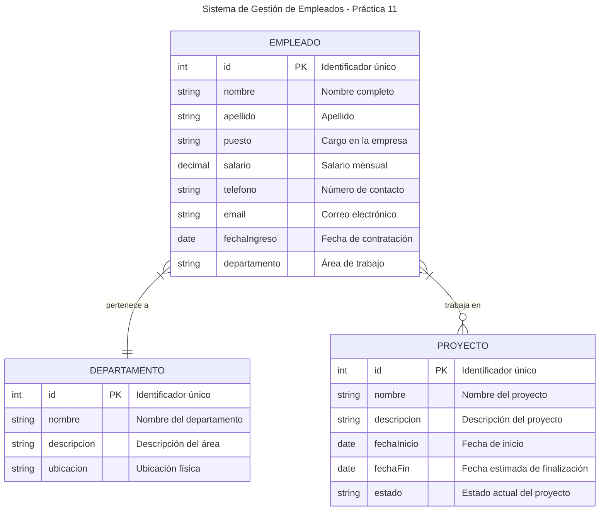

# 🚀 Guía paso a paso — Práctica 11: SQLite con Java

## 🧩 Objetivo

Construir una aplicación Android llamada **practica11** que utilice **SQLite** para realizar operaciones CRUD (Crear, Leer, Actualizar y Eliminar) sobre una tabla de empleados.  
La práctica tiene como propósito aplicar los conceptos de **SQL** y **SQLite** en el contexto del desarrollo móvil con Android.

---

## 🧠 Teoría previa

### ¿Qué es SQL?

SQL (Structured Query Language) es el lenguaje estándar para manipular datos en bases de datos relacionales. Permite:

-  Crear tablas y esquemas (`CREATE TABLE`).
-  Insertar, modificar y eliminar datos (`INSERT`, `UPDATE`, `DELETE`).
-  Consultar información (`SELECT`).
-  Controlar transacciones.

### ¿Qué es SQLite?

SQLite es una implementación ligera y embebida del lenguaje SQL.  
Características:

-  No necesita servidor (usa archivos locales `.db`).
-  Ideal para dispositivos móviles.
-  Compatible con la mayoría de los comandos SQL.
-  Está **integrado en Android** por defecto.

### 📊 Diagrama Entidad-Relación de nuestra práctica

Para visualizar mejor la estructura de datos que manejaremos en esta práctica, aquí está el diagrama entidad-relación de nuestra base de datos de empleados:



**💡 Explicación del diagrama:**

-  **EMPLEADO**: Entidad principal que almacena la información básica de cada trabajador
-  **DEPARTAMENTO**: Organiza a los empleados por áreas de trabajo
-  **PROYECTO**: Representa los proyectos en los que pueden participar los empleados
-  **Relaciones**: Un empleado pertenece a un departamento y puede trabajar en varios proyectos

En esta práctica nos enfocaremos principalmente en la entidad **EMPLEADO** para aprender los conceptos fundamentales de SQLite.

---

## ⚙️ Paso 1: Crear el proyecto

1. Abre **Android Studio** → **New Project → Empty Views Activity**
2. Asigna estos valores:
   -  **Name:** `practica11`
   -  **Language:** Java
   -  **Minimum SDK:** API 28
3. Clic en **Finish**.

---

## ⚙️ Paso 2: Configurar Gradle

Abre el archivo `app/build.gradle` y asegúrate de incluir lo siguiente:

```gradle
android {
    namespace 'com.example.practica11'
    compileSdk 28

    defaultConfig {
        applicationId "com.example.practica11"
        minSdk 21
        targetSdk 28
        versionCode 1
        versionName "1.0"
    }

    buildFeatures {
        viewBinding true
    }
}

dependencies {
    implementation 'androidx.appcompat:appcompat:1.1.0'
    implementation 'com.google.android.material:material:1.2.1'
    implementation 'androidx.constraintlayout:constraintlayout:1.1.3'
    implementation 'androidx.recyclerview:recyclerview:1.1.0'
    implementation 'androidx.cardview:cardview:1.0.0'
}
```

Sincroniza con **Sync Now** cuando Android Studio lo indique.

---

## 🧱 Paso 3: Crear la estructura de paquetes

Dentro de `java/com.example.practica11/` crea las carpetas:

```
├── data
├── model
└── ui
```

Cada paquete contendrá una parte de la arquitectura MVC de la app.

---

## 🧩 Paso 4: Crear las clases Java

### 4.1 `model/Employee.java`

Define el modelo de datos.

```java
public class Employee {
    private long id;
    private String name;
    private String position;
    private double salary;

    // Constructores, getters y setters
}
```

---

### 4.2 `data/DBContract.java`

Define la estructura de la tabla.

```java
public final class DBContract {
    public static class EmployeeEntry implements BaseColumns {
        public static final String TABLE_NAME = "employees";
        public static final String COL_NAME = "name";
        public static final String COL_POSITION = "position";
        public static final String COL_SALARY = "salary";

        public static final String SQL_CREATE_TABLE =
            "CREATE TABLE " + TABLE_NAME + " (" +
            _ID + " INTEGER PRIMARY KEY AUTOINCREMENT, " +
            COL_NAME + " TEXT NOT NULL, " +
            COL_POSITION + " TEXT, " +
            COL_SALARY + " REAL DEFAULT 0);";
    }
}
```

---

### 4.3 `data/DBHelper.java`

Crea y gestiona la base de datos.

```java
public class DBHelper extends SQLiteOpenHelper {
    private static final String DB_NAME = "company.db";
    private static final int DB_VERSION = 1;

    public DBHelper(Context context) {
        super(context, DB_NAME, null, DB_VERSION);
    }

    @Override
    public void onCreate(SQLiteDatabase db) {
        db.execSQL(DBContract.EmployeeEntry.SQL_CREATE_TABLE);
    }

    @Override
    public void onUpgrade(SQLiteDatabase db, int oldVersion, int newVersion) {
        db.execSQL("DROP TABLE IF EXISTS employees");
        onCreate(db);
    }
}
```

---

### 4.4 `data/EmployeeDao.java`

Contiene los métodos CRUD.

```java
public class EmployeeDao {
    private final DBHelper helper;

    public EmployeeDao(Context context) { helper = new DBHelper(context); }

    public long insert(Employee e) { /* INSERT con ContentValues */ }
    public int update(Employee e) { /* UPDATE con ContentValues */ }
    public int delete(long id) { /* DELETE */ }
    public List<Employee> getAll() { /* SELECT * FROM employees */ }
}
```

---

## 🎨 Paso 5: Crear los layouts XML

### 5.1 `activity_main.xml`

Contiene el RecyclerView y el FAB.

```xml
<androidx.coordinatorlayout.widget.CoordinatorLayout ...>
    <androidx.recyclerview.widget.RecyclerView
        android:id="@+id/rvEmployees"
        android:layout_width="match_parent"
        android:layout_height="match_parent"/>
    <com.google.android.material.floatingactionbutton.FloatingActionButton
        android:id="@+id/fabAdd"
        app:srcCompat="@android:drawable/ic_input_add"/>
</androidx.coordinatorlayout.widget.CoordinatorLayout>
```

### 5.2 `item_employee.xml`

Diseño para cada tarjeta de empleado.

```xml
<androidx.cardview.widget.CardView ...>
    <LinearLayout ...>
        <TextView android:id="@+id/tvName" />
        <TextView android:id="@+id/tvPosition" />
        <TextView android:id="@+id/tvSalary" />
    </LinearLayout>
</androidx.cardview.widget.CardView>
```

### 5.3 `dialog_employee.xml`

Formulario para agregar/editar empleados.

```xml
<LinearLayout ...>
    <EditText android:id="@+id/etName" android:hint="Nombre" />
    <EditText android:id="@+id/etPosition" android:hint="Puesto" />
    <EditText android:id="@+id/etSalary" android:hint="Sueldo" />
</LinearLayout>
```

---

## 🧩 Paso 6: Crear el adaptador

`ui/EmployeeAdapter.java` manejará el RecyclerView.

```java
public class EmployeeAdapter extends RecyclerView.Adapter<EmployeeAdapter.VH> {
    public interface OnItemClick { void onEdit(Employee e); void onDelete(Employee e); }
    // Implementación de onBindViewHolder, ViewHolder y eventos
}
```

---

## 🧭 Paso 7: Programar la actividad principal

`ui/MainActivity.java` controlará la UI y las operaciones CRUD.

-  **Agregar empleado:** clic en el FAB.
-  **Editar:** clic sobre un ítem.
-  **Eliminar:** clic largo.

```java
public class MainActivity extends AppCompatActivity {
    private EmployeeDao dao;
    private EmployeeAdapter adapter;

    protected void onCreate(Bundle savedInstanceState) {
        super.onCreate(savedInstanceState);
        setContentView(R.layout.activity_main);
        dao = new EmployeeDao(this);
        // Configurar RecyclerView y eventos
    }
}
```

---

## ▶️ Paso 8: Ejecutar la aplicación

1. Conecta un emulador o dispositivo físico.
2. Ejecuta el proyecto (`Run ▶`).
3. Verifica:
   -  Se muestra una lista vacía o con datos iniciales.
   -  Puedes agregar, editar y eliminar empleados.

---

## ✅ Validación del ejercicio

| Elemento                           | Verificado |
| ---------------------------------- | ---------- |
| Base de datos creada correctamente | ✅         |
| Inserción de empleados             | ✅         |
| Edición y actualización            | ✅         |
| Eliminación funcional              | ✅         |
| Uso correcto de SQLiteOpenHelper   | ✅         |
| Diseño funcional con RecyclerView  | ✅         |

---

## 🧩 Extensiones opcionales

-  Agregar un filtro de búsqueda.
-  Exportar los datos a CSV.
-  Agregar validación avanzada en los diálogos.

---

## 📚 Bibliografía

-  Flip Android (s.f.) _Uso de SQLite en Android Development._
-  Smyth, N. (2020). _Android Studio 3 Development Essentials._ Payload Media.
-  Google Developers (2024). [SQLite Databases](https://developer.android.com/training/data-storage/sqlite)

---

Asignatura: Diseño de Aplicaciones en Plataforma Android
